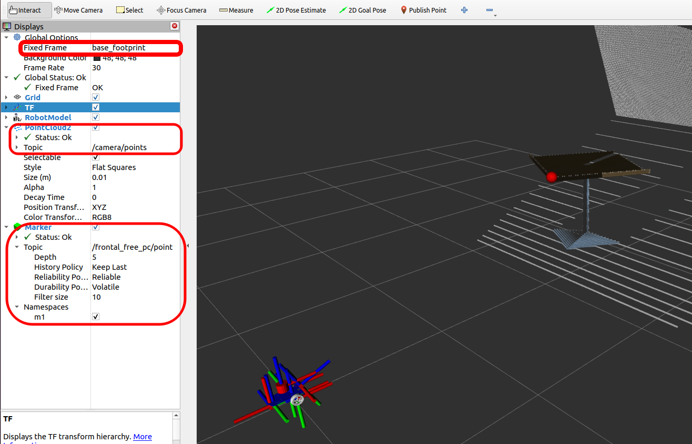

# frontal_free_pc

ROS 2 package to obtain the nearest point in front of robot. The node and its component version are included, for comparison purposes.
The nearest point is published on 'frontal_free_pc/point' topic for debugging.

[]()


**Author:** C. Mauricio Arteaga-Escamilla from "Robotica Posgrado"<br>
**Contact email:** cmauricioae8@gmail.com<br>
**LinkedIn:** https://linkedin.com/in/cruz-mauricio-arteaga-escamilla/<br>


## Table of Contents 
1. [Building this package](#building-this-package)
2. [frontal_free_pc functionality](#frontal_free_pc-functionality)
3. [Usage](#usage)
4. [Expected result](#expected-result)
5. [Possible errors and reasons](#possible-errors-and-reasons)


## Building this package

To cloning this repo with dependencies verification:

```bash
cd ~/colcon_ws/src
git clone https://github.com/cmauricioae8/frontal_free_pc.git
cd ~/colcon_ws
rosdep install -i --from-path src --rosdistro $ROS_DISTRO -y
```

If you already have all your dependencies, the console will return:<br>
#All required rosdeps installed successfully

> [!NOTE]
> This is made only once for the whole workspace.


To build this package:
```bash
colcon build --packages-select frontal_free_pc --symlink-install
source install/setup.bash
```

After building correctly, if `ros2 component types`,
the component will be listed as
```
frontal_free_pc
    free_pc_ns::FrontalFreePC
```

> [!IMPORTANT]
> By default, the example 'frontal_free_pc' node is NOT generated. If user wants to create the corresponding node, <span style="color:green">**it is required to comment the component creation lines in the 'CMakeLists.txt', to first generate the node.**</span>  If all lines are not comment, the component will be created only.


## frontal_free_pc functionality

This node computes the nearest point in front of a robot from 'cloud' topic, and publishes the distance 
(along the depth axis) on 'frontal_free_pc' topic with 'std_msgs/msg/Float32' type.

For debugging purposes, the nearest point is published on 'frontal_free_pc/point' topic 
(visualization_msgs/msg/Marker), by the 'debug_mode' param. If debug_mode is False, the topic is removed.
Some information about latency is shown in terminal.

The 'reduce_resolution' param is used to reduce the required time of calculating point by skipping some 
pixels (horizontal only).
Every second, is check the frequency of the cloud topic input to guarantee data streaming.
Since the pointcloud data could be noisy, a first order low-pass filter is implemented to computed the 
depth distance of the nearest point.

### Published topics

* `frontal_free_pc` (std_msgs/msg/Float32)<br>
    The distance of the nearest point in front of the robot, along the depth axis in meters.
* `frontal_free_pc/point` (visualization_msgs/msg/Marker)<br>
    The 3D point corresponding to the nearest point to be shown in Rviz, for debugging. If `debug_mode` param is False, this topic is removed.

### Subscribed topics

- `cloud` (sensor_msgs/msg/PointCloud)<br>
    The input point cloud. This topic frequency is checked to inform data status.

### Parameters

* `max_depth_x` (double) - The maximum depth distance to consider a possible crash (in front of the robot)
* `robot_width` (double, fixed) - Robot width
* `min_height` (double, fixed) - The minimum vertical distance to take into account an object in front
* `max_height` (double, fixed) - The maximum vertical distance to take into account an object in front
* `target_frame` (string, fixed) - The target frame to validate robot size
* `debug_mode` (bool) - ROS param to publish the nearest point, for debug
* `reduce_resolution` (int) - Resolution reducer to minimize the time to obtain the nearest point
* `filter_gain` (double) - Filter gain in (0,1)

**Note:** Params fixed cannot be modified at runtime. 


## Usage :rocket:

To test the frontal_free_pc functionality, `loading the component`

```bash
ros2 launch frontal_free_pc component_launch.py
```

This launch creates a container and loads the component using the 'parameters.yaml' file.

Additionally, the 'launch/load_launch.py' file is an example of loading a component on an existing container.


### Testing the component

To test this component without using the 'component_launch.py'

In one terminal:
```bash
ros2 run rclcpp_components component_container
```
This creates a component container (with name /ComponentManager)

In another terminal, to load (start) the component:
```bash
ros2 component load /ComponentManager frontal_free_pc free_pc_ns::FrontalFreePC
```

To unload (finish) the component
```bash
ros2 component unload /ComponentManager <component_ID>
```

### Testing the node

To test the frontal_free_pc functionality, `running the node`, if was built

```bash
ros2 launch frontal_free_pc node_launch.py
```

This launch runs the node using the 'parameters.yaml' file.
<br>


## Expected result

The following image shows the expected result.



To open Rviz with the config file from terminal:

```bash
rviz2 -d ~/colcon_ws/src/frontal_free_pc/rviz/frontal_free_pc.rviz
```


## Possible errors and reasons

+ `frontal_free_pc` topic not publishing: input cloud topic is not publishing, cloud topic remapping is not correct, TF tree is broken

+ `frontal_free_pc/point` not listed: 'debug_mode' param set to False

+ Result point is not the nearest shown point: robot size params are not correct, 'reduce_resolution' param is very large

+ Slow performance or lag: 'reduce_resolution' param is 1, 'filter_gain' param is almost 0

+ Point not shown in Rviz: the 'Fixed Frame' is not the 'target_frame' in Rviz

+ `frontal_free_pc` node does not exist: the node config was not set in 'CMakeLists.txt' when building

Return to [Table of Contents](#table-of-contents)